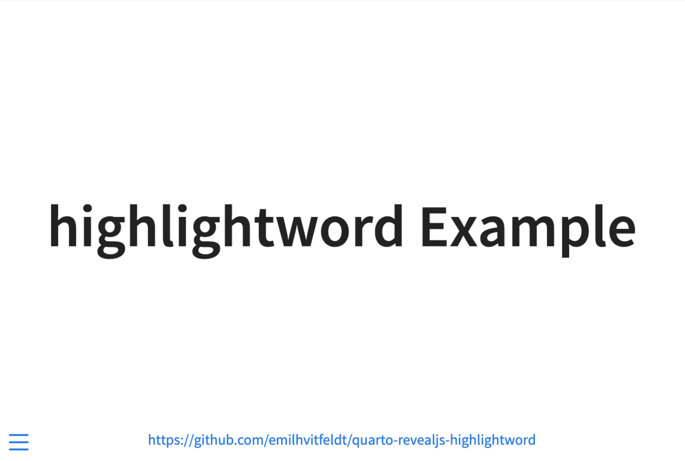

# highlightword Extension For Quarto

Revealjs plugin to highlight specific parts of code.



## Installing

```bash
quarto add emilhvitfeldt/quarto-revealjs-highlightword
```

This will install the extension under the `_extensions` subdirectory.
If you're using version control, you will want to check in this directory.

Once an extension has been added, you can use the Reveal plugin by adding it to the `reveal-plugins` key. For example:

````` markdown
---
title: "My Presentation"
format: revealjs
revealjs-plugins:
  - highlightword
---
`````

## Using

Adding a fenced with with `.fragment .highlightword` and the `word` you need, plus what any valid CSS `style` you want applied. Additional arguments `number` and `chunk` changes which match should be highlighted. See examples for more detail.

## Example

Here is the source code for a minimal example: [example.qmd](example.qmd).

